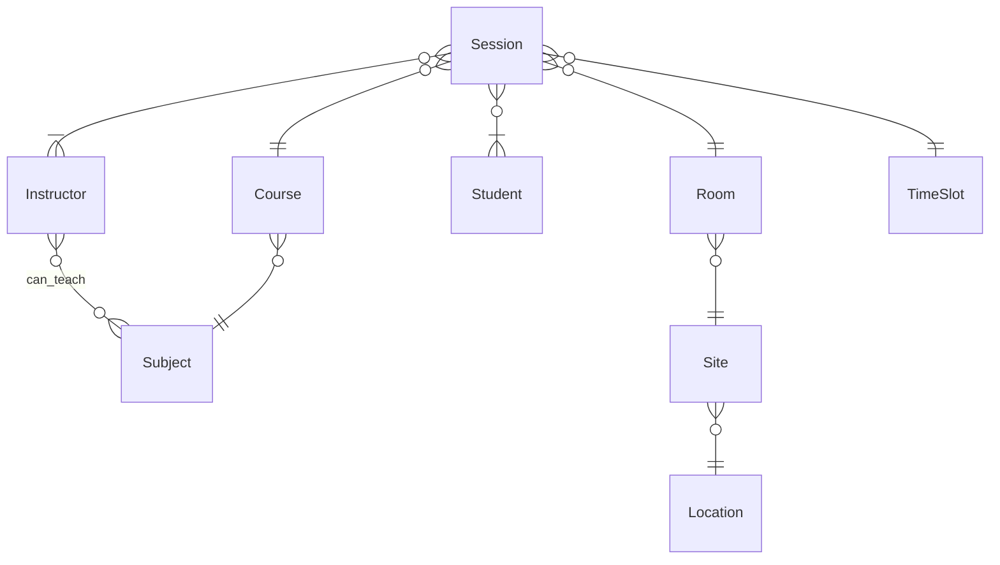

# Dasein

Dasein is an application to manage and optimize timetables and schedules for educational institutions.

## Fundamental data model

```mermaid
erDiagram
  Instructor }o--o{ Subject : "can_teach"
  Course }o--|| Subject : ""
  Session }o--|| Course : ""
  Session }o--|{ Instructor : ""
  Session }o--|{ Student : ""
  Session }o--|| Room : "" 
  Session }o--|| TimeSlot : ""
  Room }o--|| Site : ""
  Site }o--|| Location: ""
```
